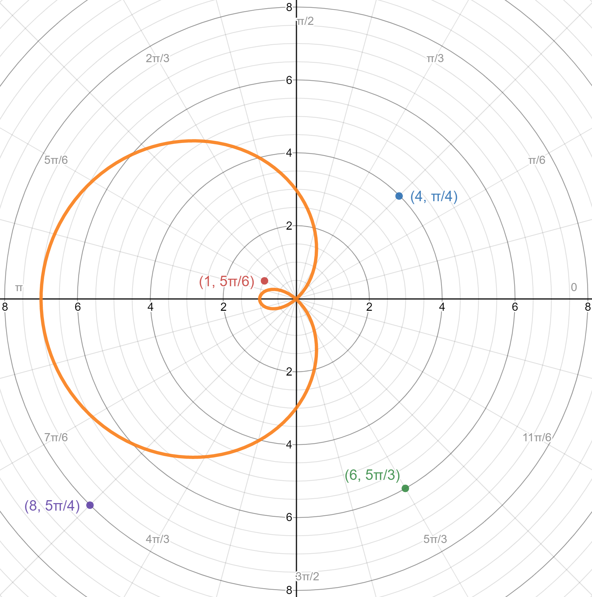
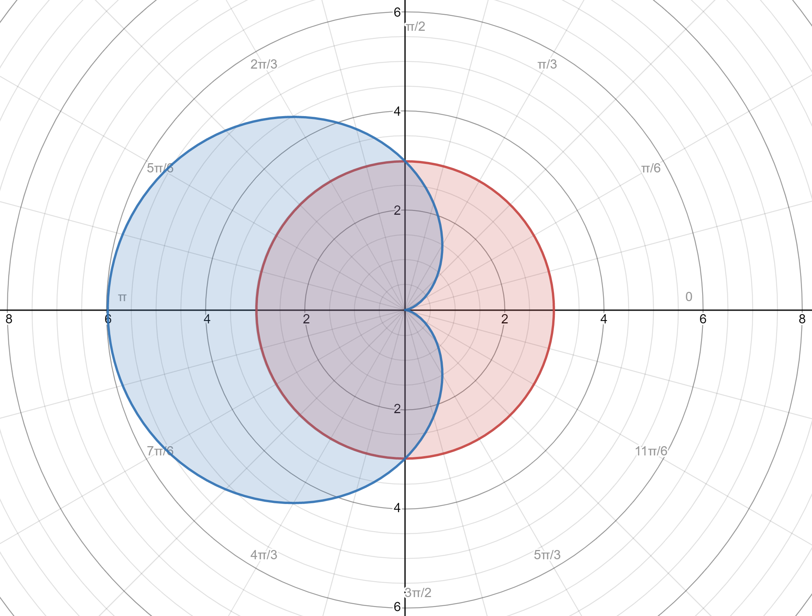

Tags: #Topic 

# Polar Equations

Polar equations are functions graphed on the polar coordinate plane.

Polar equations often follow the format of 
$$\Large r(\theta)=\ldots$$

## Parametric Polar Equations

Polar equations can also be rewritten to use the cartesian coordinate system. However since cartesian coordinates use $x$ and $y$, we need to split $r(\theta)$ into two parts.

$$
\Large
\begin{aligned}
& x = r(\theta)\cos(\theta) \\
& y = r(\theta)\sin(\theta) \\
\end{aligned}
$$

This converted set of $x$ and $y$ equations are parametric equations since they change depending on the variable $\theta$.

## Area of Polar Equation

The area of a polar equation is normally the area from the orign ($r = 0$) to $r(\theta)$.

This area can be calculated using

$$\Large A = \int_a^b \frac{1}{2} r(\theta)^2 d\theta$$

> **NOTE:**
> This is derived from the area of a sector, which is 
> 
> $$\Large A_\text{sector} = \frac{\theta}{2\pi} \pi r^2 = \frac{\theta}{2}r^2$$

## Area Using Multiple Polar Equations

**Ex.**
Given

$$
\Large
\begin{aligned}
& r_1(\theta) = 3 - 3\cos(\theta)\ \\
& r_2(\theta) = 3\ \\
\end{aligned}
$$

find the area of the purple region.

1. Find where each of the polar equations intersect one another. 

1. Divide the polar equations into sectors based on the intersection points.

1. Integrate of each of the sectors separately to get the different sectors' areas, and sum up all these areas to get the total area.

$$\Large A = \int_{-\frac{\pi}{2}}^\frac{\pi}{2} \frac{1}{2} r_1(\theta)^2 d\theta + \int_\frac{\pi}{2}^\frac{3\pi}{2} \frac{1}{2} r_2(\theta)^2 d\theta$$

## Petals

If you need to find the area of a petal in a flower polar equation, find an integral that can complete the petal without any breaks. For odd petal flowers, you may have to start from a negative angle and integrate to a positive angle to capture the first petal.