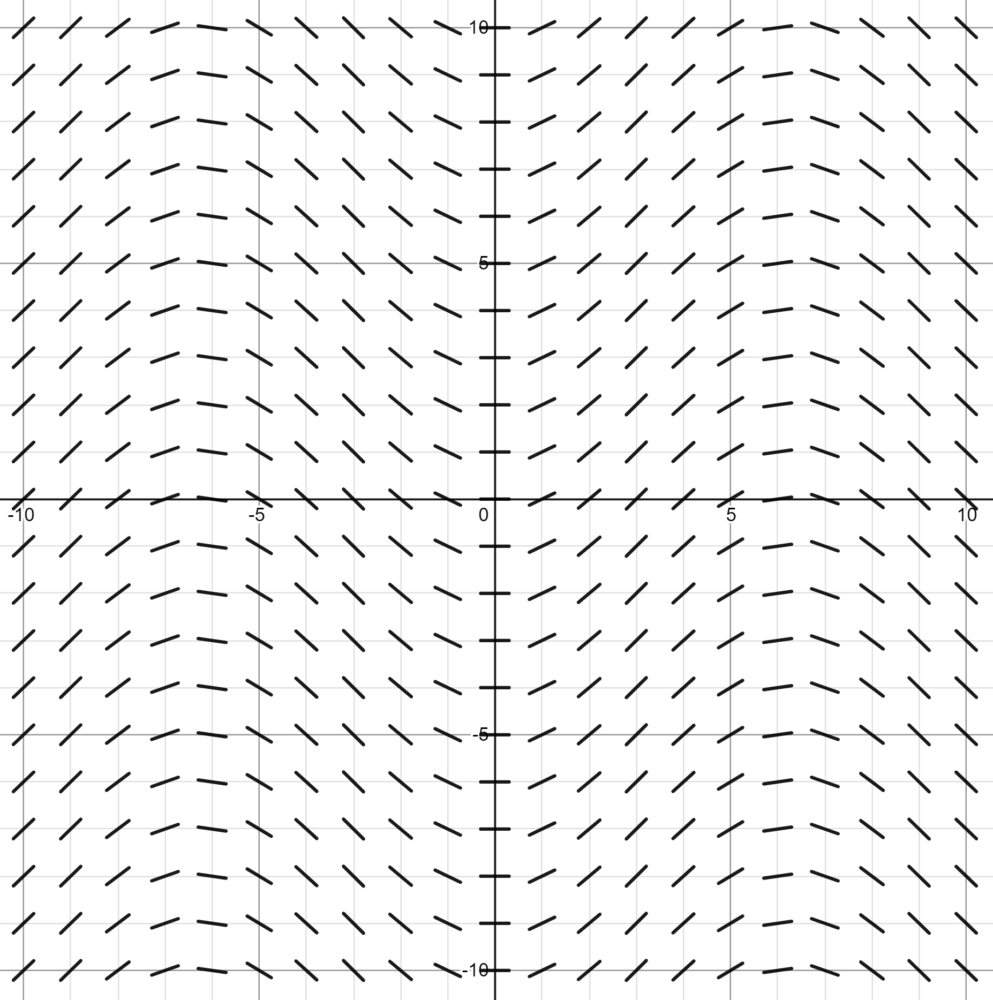

Tags: #Topic 

# Slope Fields

A slope field is a graphical representation of the possible solutions to a first-order differential equation.

The differential equation used for a slope field follows the form:

$$\Large \frac{dy}{dx} = \ldots$$

## Constructing a Slope Field

A slope field is built by going through each point on the a field of points and computing the slope at that point using the same differential equation. The slope of each point is then indicated with a small line that is tilted to match the slope at that point.

## Finding Solutions of a Differential Equation

If you pick a point $(x_1,y_1)$ on the slope field and then follow the slope at that point to another point and so forth until you have traced a line, you would be tracing a line that represents a possible solution for the field's differential equation. This possible solution would pass through your starting point of $(x_1,y_1)$.

## Variable Dependence

If a differential equation is only dependent on a single variable, lets say $x$ for example, then only changes in that variable's axis should change the shape of the graph.

> **Ex.**
> Depicted below is
> 
> $$\Large \frac{dy}{dx} = \sin \left( \frac{x}{2} \right)$$
> 
> which is only dependent on $x$. 
> 
> This means that if you move along the $x$-axis, the shape of the function **varies** and if you move on along the $y$-axos, the shape remains the **same**.
> 
> 

> **Ex.**
> Depicted below is
> 
> $$\Large \frac{dy}{dx} = y $$
> 
> which is only dependent on $y$.
> 
> This means that if you move along the $y$-axis, the shape of the function **varies** and if you move on along the $x$-axis, the shape remains the **same**.
> 
> 

> **Ex.**
> Depicted below is
> 
> $$\Large \frac{dy}{dx} = x + y $$
> 
> which is only dependent on both $x$ and $y$.
> 
> This means that if you move along either the $y$-axis or the $x$-axis, the shape of the function **varies**.
> 
> 