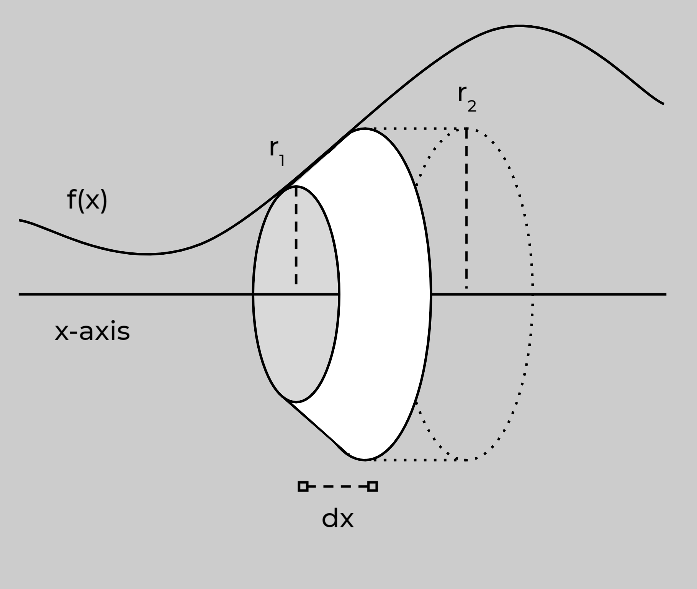

Tags: #Topic 

# Surface Area of Solid of Revolution

To find the surface area of a solid of revolution, we sum up thin rings that make up the surface of the solid. 

These rings are connected from point to point on the line, therefore we need to use the arc length formula in our area equation for a ring.

A single ring has an area of

$$
\Large
\begin{aligned}
A_\text{ring} &= 2\pi \left( \frac{1}{2} (r_1+r_2) \right) h \\
& = 2\pi \left( \frac{1}{2} \cdot 2r \right) h \\
& = 2\pi r h \\
& = 2\pi \cdot dx \cdot dL \\
& = 2\pi \cdot dx \cdot \sqrt{1 + \left( \frac{dy}{dx} \right)^2} \\\\
\end{aligned}
$$

$$
\Large
\begin{aligned}
& r_1+r_2 \approx 2r\\
& dL = \sqrt{1 + \left( \frac{dy}{dx} \right)^2}\\
\end{aligned}
$$

Diagram of a single ring in a solid of revolution:

> **NOTE:**
> Since $dx$ is really small, $r_1$ and $r_2$ would be really close together, which means $r_1+r_2$ is just $2r$, where $r=dx$.

Therefore the surface area of the entire solid would be

$$\Large A_\text{surface} = \int_a^b 2\pi \sqrt{1 + \left( \frac{dy}{dx} \right)^2}dx$$